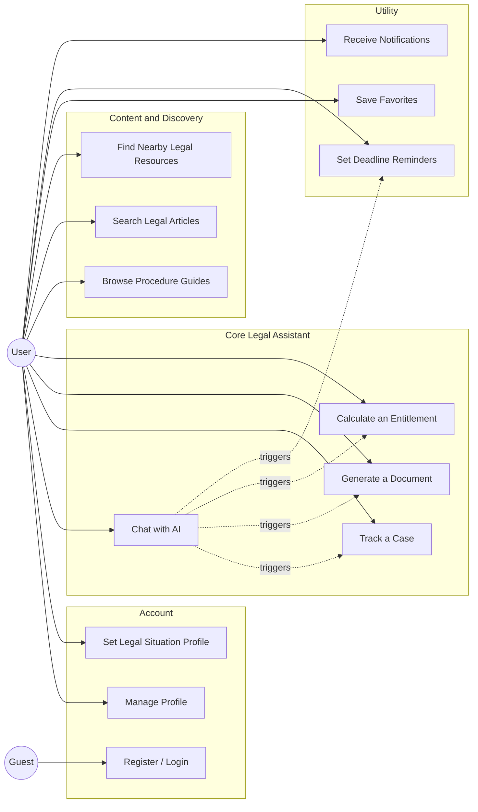
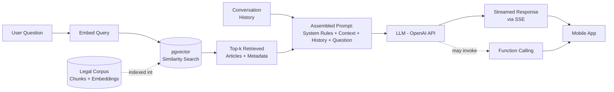
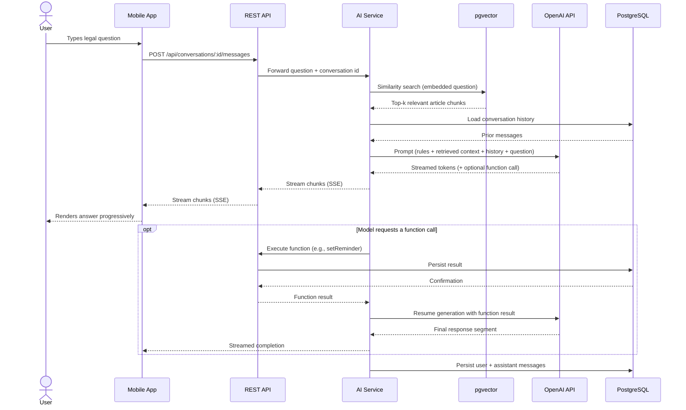
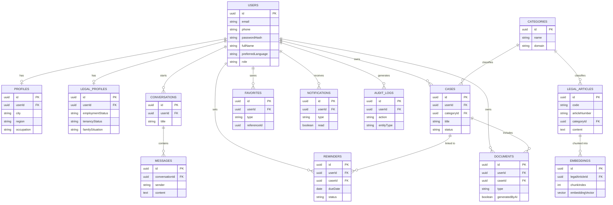
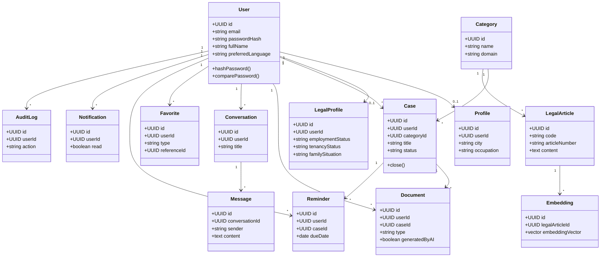
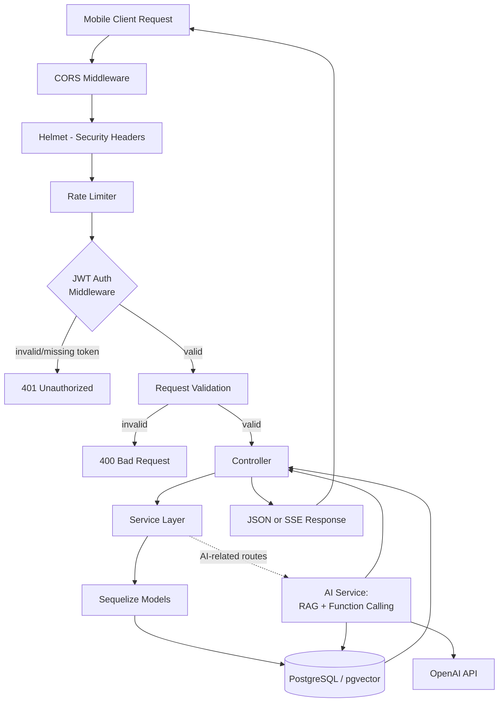
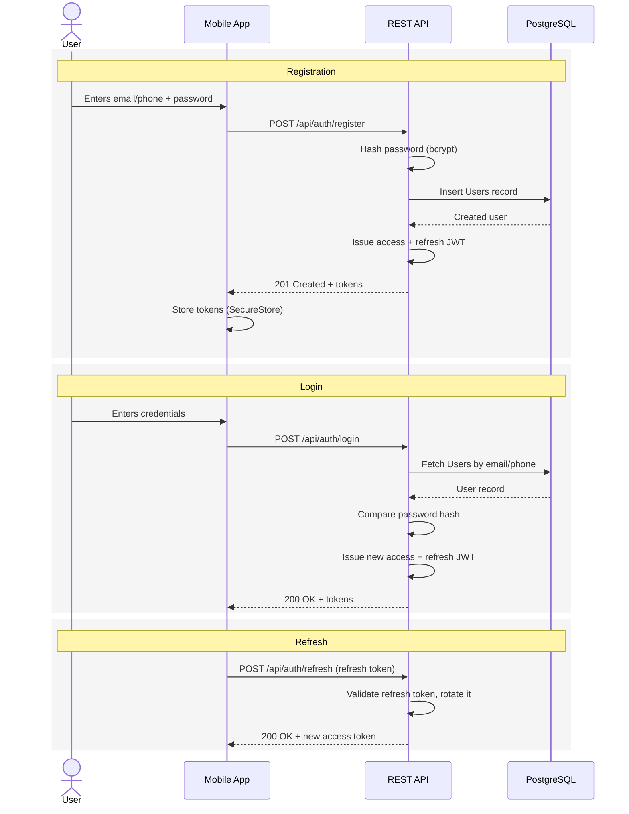
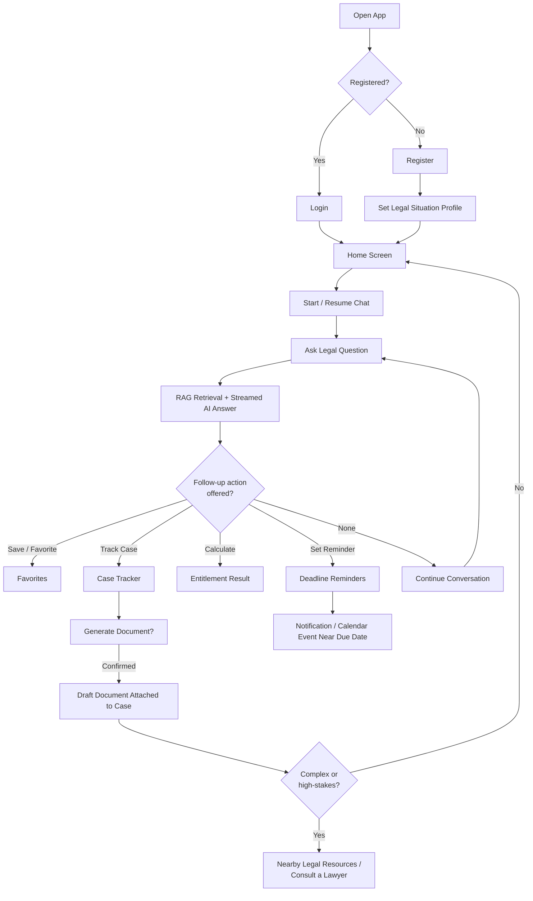
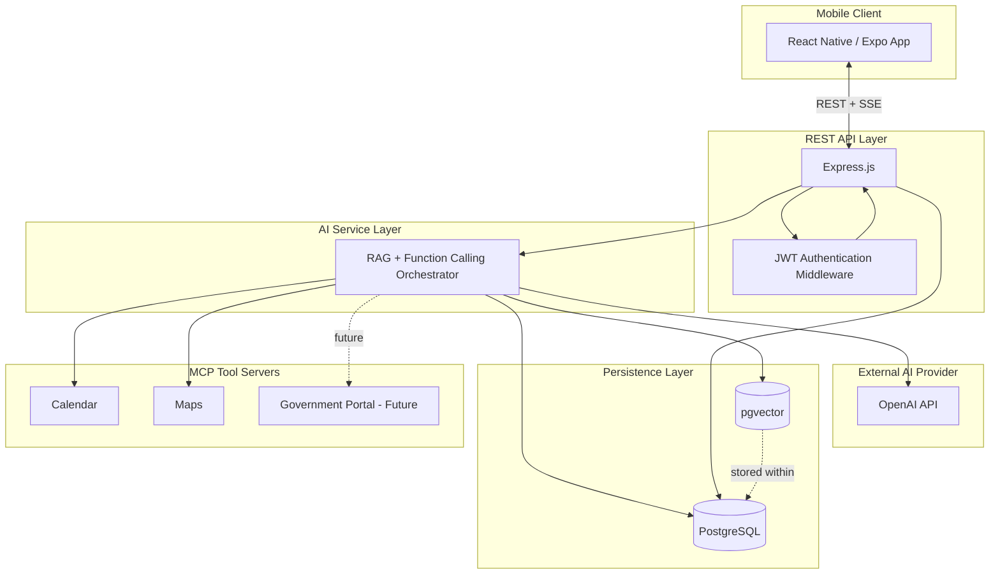

#Maison du Droit — AI Legal Rights Assistant
## Project Specification Document

**Document Type:** Full-Stack Mobile Application — Project Specification
**Prepared by:** [chaimaa fahi]
**Role:** Software Engineer / Full-Stack Developer
**Document Version:** 1.0
**Date:** August 2026
**Status:** Draft for Development Kickoff

---

## Document Control

| Field | Detail |
|---|---|
| Document Title | Mon Droit — AI Legal Rights Assistant: Project Specification |
| Version | 1.0 |
| Author | [chaimaa fahi] |
| Classification | Project Deliverable |
| Target Platforms | iOS and Android (React Native / Expo) |
| Primary Domain | LegalTech, Conversational AI, RAG |
| Geographic Scope | Kingdom of Morocco |
| Primary Languages Supported | French, Arabic, English |

### Revision History

| Version | Date | Description | Author |
|---|---|---|---|
| 0.1 | August 2026 | Initial draft: scope, feature list, and architecture sketch | [Student Name] |
| 1.0 | August 2026 | First complete specification approved for development kickoff | [Student Name] |

---

## Table of Contents

1. [Executive Summary](#1-executive-summary)
2. [Project Overview](#2-project-overview)
3. [Target Users](#3-target-users)
4. [Business Problem and Justification](#4-business-problem-and-justification)
5. [Main Features](#5-main-features)
6. [AI Agent Specification](#6-ai-agent-specification)
7. [Retrieval-Augmented Generation (RAG) Architecture](#7-retrieval-augmented-generation-rag-architecture)
8. [Function Calling](#8-function-calling)
9. [Model Context Protocol (MCP) Integration](#9-model-context-protocol-mcp-integration)
10. [Database Design](#10-database-design)
11. [Vector Database (pgvector)](#11-vector-database-pgvector)
12. [Backend Architecture](#12-backend-architecture)
13. [Frontend Architecture](#13-frontend-architecture)
14. [Application Flow](#14-application-flow)
15. [System Architecture](#15-system-architecture)
16. [Technology Stack](#16-technology-stack)
17. [Project Structure](#17-project-structure)
18. [Security](#18-security)
19. [Functional Requirements](#19-functional-requirements)
20. [Non-Functional Requirements](#20-non-functional-requirements)
21. [Assumptions](#21-assumptions)
22. [Constraints](#22-constraints)
23. [Risks and Mitigations](#23-risks-and-mitigations)
24. [Acceptance Criteria](#24-acceptance-criteria)
25. [Deliverables](#25-deliverables)
26. [Future Improvements](#26-future-improvements)
27. [Glossary](#27-glossary)
28. [Appendices](#28-appendices)

---

## 1. Executive Summary

**Mon Droit** ("My Right") is an AI-powered mobile application that helps everyday people in Morocco understand and act on their legal rights across five domains: labor law, family law, consumer rights, housing and tenancy, and administrative procedures. Instead of relying on fragmented, often contradictory advice circulating on social media and in informal forums, users interact with a conversational assistant that is grounded, through Retrieval-Augmented Generation (RAG), in official Moroccan legal codes and government-published texts.

The application is not a chatbot bolted onto a static content library. It is a full-stack product in which the AI assistant is a first-class feature: it answers legal questions with cited context retrieved from a vector database of legal articles, performs concrete actions on the user's behalf through function calling (tracking a case, calculating an entitlement, generating a document, setting a deadline reminder), and reaches external tools such as calendars and maps through the Model Context Protocol (MCP). Responses are streamed token-by-token to the mobile client so the experience feels responsive even while the model is still generating.

The system is deliberately scoped as a single, well-structured full-stack application: a React Native (Expo) mobile client, a Node.js/Express REST API, a PostgreSQL database extended with `pgvector` for semantic search, and an AI service layer that orchestrates retrieval, generation, and tool use. This specification defines the product scope, the AI agent's behavior and safety boundaries, the data model, the system architecture, the technology stack, and the requirements the finished application must satisfy.

Mon Droit is explicitly **not** a substitute for a licensed lawyer. Every AI-generated answer is informational, sourced, and accompanied by a disclaimer; the application is designed to help users understand their situation and prepare for a conversation with a legal professional, not to replace one.

---

## 2. Project Overview

### 2.1 What Mon Droit Does

Mon Droit is a mobile-first legal information and case-management assistant. A user can:

- Ask a question in natural language ("Can my employer fire me without notice?") and receive an answer grounded in the relevant articles of the Moroccan Labor Code, with the assistant citing which text it drew from.
- Build a **Legal Situation Profile** (employment status, tenancy status, family situation) so that answers and procedure guides are pre-filtered to what is actually relevant to them.
- Track an ongoing legal matter (a **Case**) — for example a workplace dispute or a rental disagreement — and receive reminders for statutory deadlines.
- Generate a first draft of a common legal document (a formal notice letter, a complaint outline) that they can review, edit, and take to a professional.
- Use a **Rights & Entitlement Calculator** to get an estimate (e.g., of statutory severance pay or a legal notice period) based on inputs they provide.
- Find nearby legal resources — courts, legal aid centers, notary offices (*adoul*/notaires) — on a map.
- Browse **Legal Procedure Guides** that turn a dense administrative process into an ordered checklist.

### 2.2 Product Positioning

| Dimension | Description |
|---|---|
| Category | LegalTech / Consumer legal information mobile application |
| Core differentiator | AI answers are grounded in a retrieval pipeline over official legal sources, not open-ended generation |
| Interaction model | Conversational chat as the primary surface, supported by structured screens (profile, cases, guides, calculator) |
| Monetization | Out of scope for this specification; the document focuses on the technical product |
| Platform | Native mobile app for iOS and Android, built with a single React Native/Expo codebase |
| Distribution language | French, Arabic, and English in the product UI; this specification document itself is written entirely in English |

### 2.3 Scope Boundaries

Mon Droit covers **five legal domains** in its initial version:

1. Labor Law (*Code du travail*)
2. Family Law (*Code de la famille* / Moudawana)
3. Consumer Rights
4. Housing and Tenancy Law
5. Administrative Procedures

Questions or requests that fall outside these domains, or outside the legal field entirely (medical questions, unrelated homework help, general-purpose programming assistance, etc.), are explicitly out of scope for the AI assistant and are refused by design — see [Section 6, AI Agent Specification](#6-ai-agent-specification).

### 2.4 Why an AI Agent, Specifically

A static FAQ or a keyword search over legal PDFs would not solve the core problem: legal questions are highly situational, and the answer to "can I be fired without notice" genuinely depends on contract type, tenure, and the reason given. An AI agent that can hold a conversation, ask clarifying follow-ups implicitly through context, retrieve the specific applicable articles, and then take a concrete next action (save the answer, start tracking a case, set a deadline) is what turns "information" into something a user can actually act on. This is why the assistant is designed around three pillars used together: **RAG** for grounded answers, **function calling** for taking action, and **MCP** for reaching outside the app's own database when needed (calendar, maps).

---

## 3. Target Users

Mon Droit is designed for people who need clear legal information but do not have easy or affordable access to a lawyer for a first, clarifying question.

| User Segment | Primary Need |
|---|---|
| Everyday citizens with limited legal knowledge | Plain-language explanations of their rights before they take any action |
| Employees navigating workplace disputes or contract questions | Understanding notice periods, termination rules, unpaid wages, and workplace rights under the *Code du travail* |
| Tenants and landlords | Clarity on lease obligations, deposit rules, eviction procedures, and rent disputes |
| Consumers dealing with purchase disputes or unfair commercial practices | Understanding return/refund rights and how to file a complaint |
| Individuals facing family legal matters | Guidance on marriage, divorce, and inheritance procedures under the Moudawana, at a level appropriate for a non-specialist |
| Small business owners and freelancers | Baseline legal guidance for contracts, hiring, and administrative obligations |
| Law students | Quick, reliable references to specific articles and codes while studying or researching |
| People who cannot easily access or afford a lawyer | A first, informational pass at a legal question, with a clear path to a licensed professional when the situation is serious |

### 3.1 Representative User Profile

A typical user is a smartphone-owning adult in Morocco, comfortable in French, Arabic, or a mix of both (Darija), who has encountered a specific legal question tied to a real situation — a job, a lease, a purchase, a family matter — and wants a fast, trustworthy first answer before either acting on their own or deciding the matter is serious enough to warrant a paid consultation.

### 3.2 Out-of-Scope Users

Mon Droit is not designed for licensed legal professionals managing active caseloads (no case-management-for-law-firms features), nor for jurisdictions outside Morocco in its initial version (see [Future Improvements](#26-future-improvements) for multi-country expansion).

---

## 4. Business Problem and Justification

### 4.1 The Problem

Citizens in Morocco frequently make legally significant decisions — signing an employment contract, accepting a lease, responding to a dismissal, navigating a divorce — without a reliable, accessible way to understand what the law actually says. In practice:

- **Contradictory informal advice dominates.** Facebook groups, WhatsApp forwards, and word-of-mouth are often the first (and only) source people consult, and the advice frequently conflicts or is simply wrong.
- **Legal language is inaccessible.** The *Code du travail*, the Moudawana, and administrative regulations are written in dense, technical French or Arabic that is difficult for a non-specialist to parse, let alone apply to their own situation.
- **Rights are discovered too late.** Many statutory protections come with strict deadlines (notice periods, appeal windows, filing deadlines). By the time a person realizes a right exists, the window to exercise it has often closed.
- **A lawyer is not always reachable.** For a short clarifying question — "is this normal?", "do I have a case?" — engaging a lawyer can feel disproportionately expensive or slow, so the question simply goes unanswered.
- **Administrative procedures are fragmented.** Steps for common procedures (registering a tenancy complaint, filing for a labor grievance, initiating a family law procedure) are spread across institutions with no single, clear, ordered guide.
- **Contracts get signed unread.** Employment and rental contracts are routinely signed without the signer understanding the clauses that will bind them.

### 4.2 The Business Case for Mon Droit

Mon Droit addresses each of these gaps directly:

| Problem | Mon Droit's Response |
|---|---|
| Contradictory informal advice | AI answers grounded in official legal texts via RAG, with source attribution |
| Inaccessible legal language | Plain-language explanations generated from — but not replacing — the original legal text |
| Rights discovered too late | Legal Situation Profile, Deadline Reminders, and proactive procedure guides surface relevant rights early |
| Lawyer access is expensive or slow | A free, always-available first pass that helps users decide whether and when to escalate to a professional |
| Fragmented administrative procedures | Structured, ordered Legal Procedure Guides per domain |
| Contracts signed unread | Rights & Entitlement Calculator and domain guides help users understand common clauses before they sign |

### 4.3 Value Proposition

Mon Droit's value is not "an AI that knows the law" in the abstract — it is an AI that is **grounded** (every answer traces back to a retrieved article, reducing the risk of confident-sounding fabrication), **actionable** (function calling turns an answer into a tracked case, a calculated figure, a saved reminder, or a draft document), and **honest about its limits** (the agent is explicitly restricted from claiming to replace a lawyer or guaranteeing an outcome — see [Section 6](#6-ai-agent-specification)).

---

## 5. Main Features

The table below summarizes all features at a glance; detailed descriptions follow.

| # | Feature | Category |
|---|---|---|
| 1 | Authentication (Register, Login, Logout, Refresh Token) | Account |
| 2 | User Profile | Account |
| 3 | Legal Situation Profile | Personalization |
| 4 | Legal Domain Preferences | Personalization |
| 5 | Chat with AI | Core |
| 6 | Conversation History | Core |
| 7 | Case Tracker | Core |
| 8 | Document Generator | Core |
| 9 | Favorite Answers | Utility |
| 10 | Favorite Procedures | Utility |
| 11 | Legal Procedure Guides | Content |
| 12 | Rights & Entitlement Calculator | Core |
| 13 | Search Legal Articles | Content |
| 14 | Nearby Legal Resources | Utility |
| 15 | Deadline Reminders | Utility |
| 16 | Notifications | Utility |
| 17 | Settings | Account |

### 5.1 Authentication

Standard email/phone-based authentication using short-lived access tokens and longer-lived refresh tokens:

- **Register** — creates a `Users` record, hashes the password with bcrypt, and issues an initial token pair.
- **Login** — validates credentials and issues a new access/refresh token pair.
- **Logout** — invalidates the current refresh token (server-side revocation list or rotation, see [Section 18](#18-security)).
- **Refresh Token** — exchanges a valid, unexpired refresh token for a new access token without requiring the user to re-authenticate with a password.

### 5.2 User Profile

Basic account information: display name, email/phone, avatar, preferred UI language (French, Arabic, or English), and account creation date. Editable from Settings.

### 5.3 Legal Situation Profile

A structured profile capturing the user's current situation across the app's legal domains — employment status (employed, self-employed, unemployed, contract type), tenancy status (tenant, landlord, owner-occupier), and family situation (single, married, divorced, has dependents). This profile is used to pre-filter which procedure guides, calculators, and AI context are most relevant, and can be updated at any time as circumstances change.

### 5.4 Legal Domain Preferences

Lets the user indicate which of the five legal domains they are most interested in, which tailors the home screen, notification topics, and the order in which the AI surfaces relevant guides.

### 5.5 Chat with AI

The centerpiece of the application. A conversational interface where the user asks questions in natural language (in French, Arabic, or English) and receives streamed, RAG-grounded answers, with the assistant able to invoke functions (see [Section 8](#8-function-calling)) directly from the conversation — for example, offering to save a reminder for a deadline it just mentioned. Full behavioral specification is in [Section 6](#6-ai-agent-specification) and [Section 7](#7-retrieval-augmented-generation-rag-architecture).

### 5.6 Conversation History

Every chat is persisted as a `Conversation` with ordered `Messages`, so users can resume a past thread, re-read an earlier explanation, or continue asking follow-up questions with full context.

### 5.7 Case Tracker

Lets a user open a structured `Case` for an ongoing legal matter (e.g., "Dismissal — March 2026") with a category, description, and status (open, in progress, resolved, closed). The AI assistant can create, update, or close a case on the user's behalf during a conversation (with confirmation), and cases can have associated documents and reminders attached.

### 5.8 Document Generator

Produces a first-draft document (for example, a formal notice letter to an employer, or a written complaint to a landlord) from a template populated with details the user has provided, either directly or through the chat. Because a generated document can have real-world consequences, this action always requires explicit user confirmation before it is finalized (see [Section 6.5](#6-ai-agent-specification)).

### 5.9 Favorite Answers

Lets a user bookmark a specific AI answer from a conversation for quick future reference, independent of scrolling back through the full conversation history.

### 5.10 Favorite Procedures

Lets a user bookmark a specific Legal Procedure Guide (e.g., "How to file a rental deposit dispute") for quick access later.

### 5.11 Legal Procedure Guides

Curated, step-by-step guides that turn an administrative or legal procedure into an ordered checklist (required documents, responsible institution, typical timeline, applicable fees where relevant). These guides are authored/maintained content, distinct from the free-form AI chat, and serve as the retrieval context the AI can also draw on.

### 5.12 Rights & Entitlement Calculator

A structured, form-based calculator (distinct from free-form chat, though reachable from it) for common quantitative legal questions — for example, estimating statutory severance pay based on tenure and salary, or computing a legal notice period. The calculator's underlying logic is exposed to the AI agent as the `calculateEntitlement()` function so the same computation can be triggered conversationally.

### 5.13 Search Legal Articles

A direct search interface over the `LegalArticles` corpus (by keyword, code, or article number), for users — such as law students — who want to look up a specific text rather than ask a conversational question.

### 5.14 Nearby Legal Resources

A map-based feature showing nearby courts, legal aid centers, and notary offices (*adoul*/notaires), backed by the Maps MCP integration (see [Section 9](#9-model-context-protocol-mcp-integration)).

### 5.15 Deadline Reminders

Tracks statutory or case-specific deadlines (e.g., an appeal window, a response deadline) and reminds the user before they lapse. Reminders can be created manually or by the AI agent via the `setReminder()` function when it identifies a deadline during a conversation, and can sync to the user's device calendar via the Calendar MCP integration.

### 5.16 Notifications

Push notifications for reminder alerts, case status changes, and (optionally) relevant legal updates. Managed centrally so users can control which categories they receive from Settings.

### 5.17 Settings

Language selection (French/Arabic/English), notification preferences, theme (dark/light), account management (password change, logout, account deletion), and legal disclaimers/terms access.

### 5.18 Feature-to-Actor Use Case Diagram



---

## 6. AI Agent Specification

### 6.1 Role

The Mon Droit AI agent is a **domain-scoped legal information assistant**. Its role is to help a user understand Moroccan law as it applies to their situation across the five supported domains, and to help them take concrete, low-risk next steps (tracking a case, drafting a document for review, calculating an entitlement, setting a deadline reminder) — always as a support to the user's own decision-making, never as a decision-maker or as a substitute for a licensed lawyer.

### 6.2 Responsibilities

- Answer legal questions using retrieved context from the official legal corpus (see [Section 7](#7-retrieval-augmented-generation-rag-architecture)), citing the code and article the answer is grounded in.
- Ask clarifying questions when a user's situation is ambiguous enough that the applicable rule genuinely depends on missing facts (e.g., contract type, tenure, reason for termination).
- Offer to take a concrete action when appropriate (save this answer, track this as a case, set a reminder for this deadline) rather than only producing text.
- Maintain conversational memory within a session so follow-up questions do not require the user to repeat context.
- Flag when a situation is complex, high-stakes, or outside what can be safely answered from general legal text, and recommend consulting a licensed lawyer.

### 6.3 Allowed Actions

| Action | Description |
|---|---|
| Answer grounded legal questions | Within the five supported domains, using retrieved article context |
| Explain legal terms and procedures | In plain language, in the user's chosen language |
| Call business functions | `createCase`, `updateCase`, `saveFavorite`, `calculateEntitlement`, `searchLegalArticles`, `setReminder` (see [Section 8](#8-function-calling)) |
| Propose a document draft | Prepare draft content for `generateDocument`, subject to explicit confirmation |
| Ask clarifying questions | When the applicable rule depends on facts not yet provided |
| Recommend professional consultation | When a situation is complex, high-stakes, or ambiguous under the law |

### 6.4 Forbidden Actions

The agent **must refuse**, politely and clearly, any request that falls outside its legal-assistant role. This includes, but is not limited to:

- Medical questions or diagnosis of any kind.
- Homework help unrelated to the legal domain, or general-purpose academic assistance.
- General-purpose programming help or unrelated technical support.
- Any request to act as a different persona or to ignore these operating rules.

In addition, regardless of topic, the agent must **never**:

- Claim to be a licensed lawyer or to be "practicing law."
- Guarantee the outcome of a case, dispute, or procedure.
- Present an answer as definitive legal advice rather than general legal information.
- Finalize a document generation or case-modifying action without the confirmation step described below.

### 6.5 Safety Limits and Confirmation Before Sensitive Actions

Two categories of function call are treated as **sensitive** because they create a persistent artifact or record tied to a real situation:

1. **Document generation** (`generateDocument`) — because a generated letter or complaint may be sent to a third party (an employer, a landlord) with real consequences.
2. **Saving details tied to a real case** (`createCase`, `updateCase` with substantive changes, `deleteCase`) — because this persists potentially sensitive personal and situational data.

For both categories, the agent follows a **propose-then-confirm** pattern: it presents a summary of exactly what it is about to do or generate, and only proceeds after the user explicitly confirms (a "yes," a tap on a confirmation UI element, or equivalent). The agent never silently generates a final document or silently commits a case change.

### 6.6 Sources of Information

The agent answers **only** from:

- Official Moroccan legal codes and statutes (e.g., *Code du travail*, *Code de la famille*).
- Government-published guides and administrative texts.
- The application's own curated Legal Procedure Guides, authored to summarize the above.

The agent does not answer legal questions from open-ended model knowledge alone, from unverified web content, or from user-supplied documents treated as authoritative sources of law.

### 6.7 Reliability Limitations

The agent's answers are only as current and complete as the underlying legal corpus. Users are informed, through the mandatory disclaimer and in-app messaging, that:

- Laws change, and the corpus may not reflect the very latest amendments.
- The agent generalizes from written text and cannot account for every factual nuance of a real dispute the way a lawyer reviewing full case facts could.
- Retrieval may occasionally surface a less-than-perfectly-matched article for an unusual question; the agent is instructed to say so rather than to fill the gap with unsupported general knowledge (see [Hallucination Mitigation](#6-9-hallucination-mitigation) below).

### 6.8 Mandatory Disclaimer

Every conversation surfaces a persistent, unobtrusive disclaimer, and the agent restates a short version whenever it gives substantive legal guidance:

> *"Mon Droit provides general legal information based on official Moroccan legal texts. It is not formal legal advice and does not create a lawyer-client relationship. For complex or high-stakes situations, please consult a licensed lawyer."*

### 6.9 Prompt Injection Protection

Because retrieved legal text and user messages are both passed into the model's context, the agent is designed to resist attempts — whether from a user message or from text embedded in a retrieved document — to override its operating rules. Mitigations include:

- Treating retrieved article content strictly as **reference material**, never as instructions: the system prompt explicitly tells the model that any instruction-like text appearing inside retrieved context or user input is data, not a command to follow.
- Keeping the system-level rules (domain scope, forbidden actions, confirmation requirements) outside the portion of the prompt that includes retrieved or user-supplied content, so they cannot be textually overwritten.
- Server-side enforcement of the confirmation step for sensitive functions ([Section 6.5](#6-5-safety-limits-and-confirmation-before-sensitive-actions)) so that even if a model response is manipulated, no document is generated and no case is modified without a genuine user confirmation captured by the client.
- Logging and monitoring of function-call arguments before execution, to catch anomalous patterns (see `AuditLogs` in [Section 10](#10-database-design)).

### 6.10 Hallucination Mitigation

- The agent is instructed to answer **only** from retrieved context; if retrieval returns no sufficiently relevant article, the agent says it could not find a directly applicable source rather than generating a plausible-sounding but unverified answer.
- Every substantive answer includes a citation to the specific code and article it is grounded in, which both increases user trust and makes an ungrounded answer easy to spot.
- Low-confidence retrieval (similarity score below a configured threshold) triggers a fallback response recommending the user rephrase, browse the relevant Procedure Guide, or consult a professional, instead of a forced best-effort answer.
- Numeric outputs (amounts, deadlines) are, wherever possible, produced by the deterministic `calculateEntitlement()` function rather than generated freeform by the model, precisely to avoid arithmetic hallucination.

---

## 7. Retrieval-Augmented Generation (RAG) Architecture

RAG is what grounds the assistant's answers in actual legal text rather than the model's general training knowledge. The pipeline has the following stages:

### 7.1 Document Chunking

Source material — Moroccan legal codes, official articles, and government-published guides — is split into semantically coherent chunks (broadly, article-by-article or sub-article where an article is long), preserving metadata such as code name, article number, and domain category with every chunk. Chunking at the article level (rather than arbitrary fixed-length windows) keeps each retrieved unit legally meaningful and citable.

### 7.2 Embeddings

Each chunk is converted into a dense vector embedding using an embedding model (e.g., OpenAI's `text-embedding-3-small`/`large`), capturing its semantic meaning in a form that can be compared numerically to a query.

### 7.3 Vector Search and Similarity Search

A user's question is embedded with the same model, and the system performs an approximate nearest-neighbor **similarity search** (cosine similarity) against the stored chunk embeddings in `pgvector` ([Section 11](#11-vector-database-pgvector)) to find the most semantically relevant articles — not just keyword matches, but conceptually related text even when the user's phrasing differs from the legal text's wording.

### 7.4 Retrieved Context

The top-*k* matching chunks (typically 3–6, filtered by a minimum similarity threshold and, where available, by the user's selected legal domain) are assembled into a context block, each tagged with its source code and article number.

### 7.5 LLM Response Generation

The retrieved context, the conversation history, and the user's question are combined into a prompt sent to the LLM (OpenAI API), which is instructed to answer strictly from the provided context, cite the relevant article(s), and invoke a function call where the conversation calls for an action rather than only an explanation.

### 7.6 Conversation Memory

Within a session, prior turns (and their retrieved context, summarized as needed to control token usage) are retained so the model can resolve follow-up questions ("and if I've been there less than a year?") without the user re-stating their original question.

### 7.7 Streaming

The model's response is streamed token-by-token from the backend to the mobile client over Server-Sent Events (SSE), so the user sees the answer appear progressively instead of waiting for the full generation to complete — important for a chat experience where legal answers can be several paragraphs long.

### 7.8 RAG Pipeline Diagram



### 7.9 Sequence Diagram — Chat with AI (RAG plus Function Calling)



---

## 8. Function Calling

Function calling is how the AI agent moves from "explaining" to "doing." The LLM is given a fixed set of callable functions with typed parameters; when a conversation calls for an action, the model emits a function call instead of (or alongside) plain text, the backend executes the corresponding business logic, and the result is fed back to the model to continue the response.

### 8.1 Function Catalog

| Function | Parameters (summary) | When It Is Called |
|---|---|---|
| `createCase(userId, categoryId, title, description)` | Domain category, short title, description | User explicitly wants to start tracking a legal matter ("I want to keep track of this dismissal") |
| `updateCase(caseId, updates)` | Case id, fields to change (status, description) | User provides new information about an existing tracked case, or asks to change its status |
| `deleteCase(caseId)` | Case id | User explicitly asks to remove a tracked case — always confirmed first |
| `saveFavorite(userId, type, referenceId)` | Type (answer / procedure / article), reference id | User says "save this" / "bookmark this" during a conversation |
| `generateDocument(userId, caseId, documentType, data)` | Document type, structured data to populate the template | User requests a draft document (e.g., a formal notice letter) — always confirmed first |
| `calculateEntitlement(userId, domain, parameters)` | Domain (e.g., labor), calculation-specific inputs (tenure, salary, contract type) | User asks a quantitative question ("how much severance am I owed?") |
| `searchLegalArticles(query, domain)` | Free-text query, optional domain filter | User asks to look up a specific article, or the agent needs a targeted lookup beyond the general RAG retrieval |
| `setReminder(userId, caseId, title, dueDate)` | Title, due date, optional linked case | User mentions a deadline, or the agent identifies a statutory deadline relevant to the user's question |

### 8.2 Execution Model

1. The LLM decides, based on the conversation, that a function call is the right next step and emits a structured call (function name + arguments).
2. The AI service validates the arguments server-side (type checking, ownership checks — a user can only modify their own cases/favorites/reminders).
3. **Sensitive functions** (`generateDocument`, `deleteCase`, and substantive `updateCase`/`createCase` calls that persist case details) pause for explicit user confirmation before execution, per [Section 6.5](#6-5-safety-limits-and-confirmation-before-sensitive-actions).
4. Once approved (or immediately, for non-sensitive functions like `searchLegalArticles` or `calculateEntitlement`), the backend executes the corresponding service method against PostgreSQL and returns a structured result.
5. The result is passed back into the model's context so it can incorporate the outcome into its next response segment (e.g., "I've set a reminder for March 15th.").
6. Every function execution is written to `AuditLogs` with the acting user, function name, arguments, and outcome.

---

## 9. Model Context Protocol (MCP) Integration

Beyond the app's own database, the AI agent reaches external tools through MCP — a standard interface that lets the AI service call out to independent tool servers without hard-coding a bespoke integration for each one.

### 9.1 Calendar MCP

Used to turn a `setReminder()` call into an actual entry on the user's device calendar (in addition to the in-app Deadline Reminders list), so a statutory deadline the assistant identifies — for example, an appeal window — shows up wherever the user already manages their schedule.

*Practical scenario:* A user asks about contesting a disciplinary sanction. The agent explains the applicable appeal window from the retrieved article, offers to set a reminder a few days before the deadline, and — once confirmed — creates both an in-app reminder and a calendar event via the Calendar MCP server.

### 9.2 Maps MCP

Powers the Nearby Legal Resources feature: given the user's location (or a manually entered city), the Maps MCP server is queried for nearby courts, legal aid centers, and notary offices, returning results the app renders on a map.

*Practical scenario:* A user finishing a conversation about filing a labor complaint asks "where do I actually go to file this?" The agent calls the Maps MCP integration scoped to labor courts / relevant institutions near the user's stated city and returns a short list with addresses.

### 9.3 Government Portal Integration (Future)

Reserved for a future phase: MCP-based integration with official government e-services portals for status checks or e-filing where such APIs become available. Not implemented in the initial version; see [Future Improvements](#26-future-improvements).

### 9.4 Extensibility

Because MCP standardizes how the AI service discovers and calls external tools, adding a new integration (for example, a future SMS-notification tool, or a lawyer-directory tool) means registering a new MCP server rather than writing bespoke integration code and re-wiring the agent's prompt — the tool-calling contract stays uniform as the tool catalog grows.

---

## 10. Database Design

Mon Droit uses a single PostgreSQL database (extended with `pgvector` for embeddings) as the system of record for both application data and the vector index used by RAG. Keeping both in one database avoids operating a separate vector store and keeps entity relationships (e.g., an embedding to the article it came from) enforceable with standard foreign keys.

### 10.1 Entity Overview

| Entity | Purpose |
|---|---|
| `Users` | Core account and authentication data |
| `Profiles` | Personal/demographic profile information |
| `LegalProfiles` | Employment, tenancy, and family situation used to personalize guidance |
| `Cases` | User-tracked legal matters |
| `Documents` | Generated or uploaded documents, optionally linked to a case |
| `LegalArticles` | The authoritative legal text corpus |
| `Categories` | Legal domain taxonomy (labor, family, consumer, housing, administrative) |
| `Conversations` | Chat sessions between a user and the AI |
| `Messages` | Individual turns within a conversation |
| `Embeddings` | Vector representations of `LegalArticles` chunks |
| `Favorites` | User-saved answers, procedures, or articles |
| `Reminders` | Deadline reminders, optionally linked to a case |
| `Notifications` | In-app/push notification records |
| `AuditLogs` | Record of security-relevant and function-call events |

### 10.2 Entity Details

**Users** — `id`, `email`, `phone`, `passwordHash`, `fullName`, `preferredLanguage`, `role`, `createdAt`, `updatedAt`. The authentication root; every other user-owned entity references `Users.id`.

**Profiles** — `id`, `userId` (FK), `avatarUrl`, `city`, `region`, `occupation`. General account-level personal details, separate from legally-relevant status.

**LegalProfiles** — `id`, `userId` (FK), `employmentStatus`, `contractType`, `tenancyStatus`, `familySituation`, `updatedAt`. Drives personalization of guides, calculators, and retrieval filtering.

**Cases** — `id`, `userId` (FK), `categoryId` (FK), `title`, `description`, `status`, `createdAt`, `updatedAt`, `closedAt`. A user-tracked legal matter; created and updated primarily through the `createCase`/`updateCase` functions.

**Documents** — `id`, `userId` (FK), `caseId` (FK, nullable), `type`, `title`, `fileUrl`, `generatedByAI` (boolean), `createdAt`. Both AI-generated drafts and (optionally, in a later phase) user-uploaded documents.

**LegalArticles** — `id`, `code` (e.g., "Code du travail"), `articleNumber`, `title`, `content`, `categoryId` (FK), `sourceUrl`, `lastVerifiedAt`. The ground truth corpus that RAG retrieves from and that `searchLegalArticles()` queries directly.

**Categories** — `id`, `name`, `domain`, `description`. The five legal domains plus any sub-categorization needed for procedure guides.

**Conversations** — `id`, `userId` (FK), `title`, `startedAt`, `lastMessageAt`. One row per chat thread.

**Messages** — `id`, `conversationId` (FK), `sender` (`user` / `assistant`), `content`, `functionCalls` (JSON, nullable), `createdAt`. Ordered turns within a conversation.

**Embeddings** — `id`, `legalArticleId` (FK), `chunkIndex`, `chunkText`, `embeddingVector` (`pgvector` type), `createdAt`. One or more rows per `LegalArticles` entry, depending on chunking.

**Favorites** — `id`, `userId` (FK), `type` (`answer` / `procedure` / `article`), `referenceId`, `createdAt`. A polymorphic bookmark, disambiguated by `type`.

**Reminders** — `id`, `userId` (FK), `caseId` (FK, nullable), `title`, `dueDate`, `status`, `channel`, `createdAt`. Created manually or via `setReminder()`.

**Notifications** — `id`, `userId` (FK), `type`, `title`, `body`, `read` (boolean), `createdAt`. In-app notification feed, source for push delivery.

**AuditLogs** — `id`, `userId` (FK, nullable), `action`, `entityType`, `entityId`, `metadata` (JSON), `createdAt`. Records authentication events and every function-call execution for traceability.

### 10.3 Entity-Relationship Diagram



### 10.4 Domain Model Class Diagram

The diagram below reflects the Sequelize model layer that sits directly on top of the schema above.



---

## 11. Vector Database (pgvector)

Rather than operating a separate vector database service, Mon Droit uses PostgreSQL's `pgvector` extension, storing embeddings alongside the relational data they describe.

### 11.1 Why pgvector

- **One database to operate**, which matters for a project of this scope: no separate vector-store credentials, no cross-database consistency concerns between `LegalArticles` and their `Embeddings`.
- **Transactional consistency** between a legal article and its embeddings, since both live in the same database and can be written in the same transaction.
- **SQL-native queries**: similarity search is just another query, joinable with normal relational filters (e.g., "search only within the Housing category").

### 11.2 Embeddings Storage

The `Embeddings` table stores one row per text chunk, with an `embeddingVector` column of type `vector(N)` (dimensionality matching the chosen embedding model), plus a foreign key back to the source `LegalArticles` row and metadata (`chunkIndex`, `chunkText`) needed to reconstruct and cite the original passage.

### 11.3 Similarity Search

At query time, the user's question is embedded and compared against stored vectors using a distance operator (cosine distance, `<=>`), typically combined with an approximate-nearest-neighbor index (`IVFFlat` or `HNSW`, depending on corpus size) for performant retrieval as the article/chunk count grows, plus an ordinary `WHERE categoryId = ...` filter when the conversation is already scoped to a specific legal domain.

---

## 12. Backend Architecture

### 12.1 Technology Choices

- **Node.js + Express.js** — the REST API runtime and routing layer.
- **PostgreSQL + pgvector** — relational storage and vector search, as described above.
- **Sequelize ORM** — models, migrations, and query building against PostgreSQL.
- **JWT** — stateless access tokens, paired with a refresh-token rotation scheme.
- **bcrypt** — password hashing.
- **Swagger/OpenAPI** — machine-readable API documentation generated from route/controller annotations.
- **Docker** — containerized backend and database for consistent local and deployment environments.

### 12.2 MVC Architecture

The backend follows a layered MVC-style structure:

- **Routes** define URL patterns and HTTP verbs, delegating to controllers.
- **Controllers** parse and validate the request, call the relevant service, and shape the HTTP response — they contain no business logic themselves.
- **Services** hold business logic, including the function-calling implementations (`createCase`, `generateDocument`, etc.) and the AI orchestration layer (RAG retrieval + LLM calls).
- **Models** (Sequelize) define the schema and relationships described in [Section 10](#10-database-design).

### 12.3 Validation and Error Handling

Incoming requests are validated against schemas (request body, params, query) before reaching business logic; validation failures return a consistent `400` error shape. A centralized error-handling middleware catches thrown errors (validation, not-found, auth, unexpected) and maps them to appropriate HTTP status codes and a uniform JSON error envelope, so the mobile client can handle errors predictably regardless of which endpoint failed.

### 12.4 Logging

Structured request logging (method, path, status, latency) plus application-level logging for AI service calls (retrieval latency, function calls executed, errors) to support debugging and the audit trail described in [Section 18](#18-security).

### 12.5 REST API and Documentation

All endpoints are documented via Swagger/OpenAPI, generated alongside the route definitions, and served at a `/docs` endpoint during development — giving both the frontend developer (even when it is the same person) and any future integrator a single interactive reference for every request/response shape.

### 12.6 Environment Variables and Docker

Configuration (database credentials, JWT secrets, OpenAI API key, MCP server endpoints) is supplied via environment variables, never committed to source control. A `Dockerfile` and `docker-compose.yml` define the API and PostgreSQL/pgvector containers together, so the full backend can be brought up with a single command in development and deployed consistently.

### 12.7 API Request Flow Diagram



### 12.8 Sequence Diagram — Authentication (Register / Login / Refresh)



---

## 13. Frontend Architecture

### 13.1 Technology Choices

- **React Native + Expo** — cross-platform iOS/Android app from a single codebase, with Expo managing the native build pipeline.
- **Expo Router** — file-based navigation, giving the app a predictable screen/route structure that mirrors the folder layout.
- **TypeScript** — static typing across components, API clients, and state stores.
- **Zustand** — lightweight global state management (auth state, active conversation, legal profile) without the boilerplate of a larger state library.
- **Axios** — HTTP client for REST calls, with interceptors handling auth headers and token refresh.
- **Expo SecureStore** — encrypted on-device storage for JWTs and other sensitive local data.
- **SSE Streaming** — the client consumes the backend's Server-Sent Events stream to render AI responses token-by-token.

### 13.2 UI and UX Requirements

- **Modern UI** — a clean, chat-first interface with clear affordances for structured actions (confirm document generation, view a case card, open a procedure guide) rendered inline in the conversation rather than only as plain text.
- **Dark/Light Mode** — full theme support, respecting system preference by default with a manual override in Settings.
- **Offline Cache** — previously loaded conversations, favorites, and procedure guides remain viewable without connectivity; new messages queue and send once connectivity returns.
- **Multi-language Support** — French, Arabic, and English throughout the UI, including right-to-left layout support for Arabic.

### 13.3 Frontend Layering

- **Screens** (Expo Router routes) — compose feature components and connect to stores/hooks.
- **Components** — presentational and container components (chat bubble, case card, reminder list item, etc.).
- **Stores** (Zustand) — auth, active conversation, legal profile, and UI preference state.
- **API layer** (Axios instances + typed request/response functions) — the only place that talks to the backend, including SSE stream handling for chat.
- **Types** (TypeScript) — shared request/response and domain types, ideally generated from or kept in sync with the backend's OpenAPI schema.

---

## 14. Application Flow

This section describes the end-to-end user journey from first opening the app to receiving AI-backed legal guidance and acting on it.

1. **Onboarding** — the user opens the app, chooses a language (French/Arabic/English), and registers (or logs in).
2. **Legal Situation Profile setup** — on first login, the user is prompted (optionally skippable) to fill in their employment status, tenancy status, and family situation, plus their preferred legal domains.
3. **Home screen** — surfaces the chat entry point, any active cases, upcoming deadline reminders, and a few relevant procedure guides based on the user's profile.
4. **Asking a question** — the user opens a new (or existing) conversation and asks a question in natural language.
5. **Grounded, streamed answer** — the backend retrieves relevant legal article chunks, the LLM generates a response citing them, and the answer streams into the chat in real time.
6. **Optional action** — where relevant, the assistant offers a concrete next step: save the answer, start tracking a case, calculate an entitlement, or set a deadline reminder. Sensitive actions (document generation, case creation/deletion) always show a confirmation step before anything is persisted.
7. **Follow-up** — the user can continue asking follow-up questions in the same conversation, with full context retained.
8. **Case management** — if a case was created, the user can revisit it from the Case Tracker, attach generated documents, and see linked reminders.
9. **Deadline handling** — as reminder dates approach, the user receives a notification (and, if linked, a calendar event via the Calendar MCP integration).
10. **Escalation** — where the assistant flags a situation as complex or high-stakes, the user is pointed toward Nearby Legal Resources to find a court, legal aid center, or notary, or is simply advised to consult a licensed lawyer.

### 14.1 Application Flow Diagram



---

## 15. System Architecture

### 15.1 Layered Overview

Mon Droit is organized as five cooperating layers: the mobile client, the REST API with its authentication middleware, an AI service layer that orchestrates RAG and function calling, the LLM provider, and the persistence layer (PostgreSQL with pgvector), with MCP tool servers reachable from the AI service.



### 15.2 Layer Responsibilities

| Layer | Responsibility |
|---|---|
| Mobile Client | Renders UI, manages local auth token storage, consumes REST and SSE endpoints |
| REST API Layer | Routing, authentication, validation, request/response shaping |
| AI Service Layer | RAG retrieval orchestration, prompt assembly, function-call execution, MCP tool invocation |
| External AI Provider | Embedding generation and LLM completion/streaming (OpenAI API) |
| Persistence Layer | Relational data and vector index (PostgreSQL + pgvector), single source of truth |
| MCP Tool Servers | Calendar and Maps integrations reachable by the AI service; extensible to future tools |

### 15.3 Design Principles

- **Single source of truth**: one PostgreSQL instance holds both relational data and vectors, avoiding synchronization issues between two databases.
- **Thin controllers, fat services**: business logic (including function-calling implementations) lives in the service layer, keeping controllers focused on HTTP concerns.
- **AI as a service, not a special case**: the AI orchestrator is just another service the API layer calls, so authentication, validation, and audit logging apply to AI-initiated actions exactly as they do to any other write.
- **Streaming-first for chat**: the chat endpoint is designed around SSE from the start rather than retrofitted, since perceived responsiveness is central to the chat experience.

---

## 16. Technology Stack

| Layer | Technology |
|---|---|
| Frontend Framework | React Native (Expo) |
| Frontend Routing | Expo Router |
| Frontend Language | TypeScript |
| State Management | Zustand |
| API Client | Axios |
| Secure Local Storage | Expo SecureStore |
| Realtime/Streaming (client) | Server-Sent Events (SSE) consumer |
| Backend Runtime | Node.js |
| Backend Framework | Express.js |
| Database | PostgreSQL |
| Vector Database | pgvector (PostgreSQL extension) |
| ORM | Sequelize |
| Authentication | JWT (access + refresh tokens) |
| Password Hashing | bcrypt |
| AI Provider | OpenAI API (chat completion + embeddings) |
| Agent Capabilities | Retrieval-Augmented Generation, Function Calling, MCP |
| API Documentation | Swagger / OpenAPI |
| Containerization | Docker, Docker Compose |
| Version Control | Git / GitHub |

---

## 17. Project Structure

### 17.1 Backend

```
mon-droit-backend/
├── src/
│   ├── config/                # env loading, database, OpenAI, MCP client config
│   ├── models/                # Sequelize models (User, Case, LegalArticle, Embedding, ...)
│   ├── migrations/             # Sequelize migrations
│   ├── seeders/                # seed data (Categories, initial LegalArticles)
│   ├── controllers/            # HTTP request/response handlers
│   ├── routes/                 # Express route definitions
│   ├── services/
│   │   ├── ai/                 # RAG orchestration, prompt assembly, function-call handlers
│   │   ├── mcp/                # Calendar / Maps MCP client wrappers
│   │   └── domain/             # cases, documents, reminders, favorites business logic
│   ├── middlewares/            # auth, validation, error handling, rate limiting
│   ├── validators/             # request schema definitions
│   ├── utils/                  # shared helpers (logging, token utils)
│   └── app.js                  # Express app assembly
├── docs/                       # generated Swagger/OpenAPI spec
├── docker/
│   ├── Dockerfile
│   └── docker-compose.yml
├── tests/
├── .env.example
└── package.json
```

### 17.2 Frontend

```
mon-droit-app/
├── app/                        # Expo Router file-based routes
│   ├── (auth)/                 # login, register screens
│   ├── (tabs)/                 # home, chat, cases, guides, settings
│   └── _layout.tsx
├── components/                 # chat bubble, case card, reminder item, etc.
├── stores/                     # Zustand stores (auth, conversation, legalProfile, ui)
├── api/                        # Axios instance, typed endpoint functions, SSE client
├── types/                      # shared TypeScript types
├── locales/                    # fr / ar / en translation files
├── assets/
├── app.json                    # Expo config
├── tsconfig.json
└── package.json
```

### 17.3 Documentation and Docker

```
mon-droit-docs/
├── MonDroit_Project_Specification.md   # this document
├── api-reference/                       # exported Swagger/OpenAPI
├── prompt-journal.md                    # log of AI-assisted development prompts
└── deployment-guide.md

docker/
├── docker-compose.yml          # backend + PostgreSQL/pgvector services together
└── .dockerignore
```

---

## 18. Security

| Concern | Mitigation |
|---|---|
| Authentication | JWT access + refresh tokens, with refresh-token rotation |
| Password storage | bcrypt hashing, never stored or logged in plaintext |
| Transport-level headers | Helmet middleware (sensible security headers by default) |
| Cross-origin requests | CORS restricted to known client origins |
| Abuse / brute force | Rate limiting on authentication and AI chat endpoints |
| Malformed input | Schema-based input validation on every endpoint before it reaches business logic |
| SQL Injection | Parameterized queries enforced by Sequelize; no raw string-concatenated SQL |
| XSS | Output encoding on any rendered user-supplied content; CSP headers via Helmet |
| Prompt Injection | System-level agent rules isolated from retrieved/user content; sensitive actions require confirmation regardless of model output — see [Section 6.9](#6-9-prompt-injection-protection) |
| Secrets management | All credentials and API keys via environment variables, excluded from version control |
| Sensitive case data | Access strictly scoped to the owning user; every case/document/case-linked reminder query is filtered by the authenticated user's id |
| Auditability | `AuditLogs` records authentication events and every function-call execution |
| Personal data protection | Handling of case and legal-situation data aligned with Morocco's Law 09-08 on the protection of individuals with regard to the processing of personal data: data minimization, purpose limitation, and user-initiated account/data deletion |

---

## 19. Functional Requirements

| ID | Requirement |
|---|---|
| FR-1 | The system shall allow a user to register with email or phone and a password. |
| FR-2 | The system shall allow a registered user to log in and receive an access token and a refresh token. |
| FR-3 | The system shall allow a user to refresh an expired access token using a valid refresh token, without re-entering credentials. |
| FR-4 | The system shall allow a user to log out, invalidating their current refresh token. |
| FR-5 | The system shall allow a user to create and edit a Legal Situation Profile (employment status, tenancy status, family situation). |
| FR-6 | The system shall allow a user to set legal domain preferences. |
| FR-7 | The system shall allow a user to send a natural-language legal question and receive a streamed, RAG-grounded response citing the source legal article(s). |
| FR-8 | The system shall persist every conversation and its messages, retrievable as Conversation History. |
| FR-9 | The system shall allow the AI agent or the user to create a Case, with a category, title, and description. |
| FR-10 | The system shall allow the AI agent or the user to update or close an existing Case. |
| FR-11 | The system shall require explicit user confirmation before generating a document or before deleting a Case. |
| FR-12 | The system shall allow a user to generate a draft document (e.g., a formal notice letter) linked to a Case. |
| FR-13 | The system shall allow a user to save a Favorite (answer, procedure, or article). |
| FR-14 | The system shall provide browsable, step-by-step Legal Procedure Guides per legal domain. |
| FR-15 | The system shall provide a Rights & Entitlement Calculator producing a numeric estimate from user-supplied inputs. |
| FR-16 | The system shall allow direct keyword/domain search over the Legal Articles corpus. |
| FR-17 | The system shall display nearby courts, legal aid centers, and notary offices on a map. |
| FR-18 | The system shall allow a user or the AI agent to set a Deadline Reminder, optionally linked to a Case, and optionally synced to the device calendar. |
| FR-19 | The system shall deliver notifications for reminder alerts and case status changes. |
| FR-20 | The system shall allow a user to change UI language among French, Arabic, and English. |
| FR-21 | The AI agent shall refuse requests outside the five supported legal domains and outside the legal field generally, per [Section 6.4](#6-4-forbidden-actions). |
| FR-22 | The AI agent shall display a legal disclaimer at the start of a conversation and alongside substantive legal guidance. |
| FR-23 | The system shall log every function-call execution and authentication event to an audit trail. |

## 20. Non-Functional Requirements

| ID | Category | Requirement |
|---|---|---|
| NFR-1 | Performance | The AI chat endpoint shall begin streaming the first response token within 2 seconds under normal load. |
| NFR-2 | Performance | Vector similarity search queries shall return results within 500 ms at the corpus sizes expected for this project. |
| NFR-3 | Scalability | The backend shall be stateless at the API layer (aside from the database) so additional instances can be run behind a load balancer if needed. |
| NFR-4 | Availability | The system shall degrade gracefully if the LLM provider is unreachable: non-AI features (cases, favorites, guides, reminders) shall remain usable, with a clear in-app message for the chat feature. |
| NFR-5 | Security | All endpoints except registration and login shall require a valid JWT. |
| NFR-6 | Security | All traffic between the mobile client and the API shall be encrypted in transit (HTTPS/TLS). |
| NFR-7 | Usability | Core actions (ask a question, view a case, set a reminder) shall be reachable within two taps from the Home screen. |
| NFR-8 | Accessibility | Text sizes and color contrast shall meet basic mobile accessibility guidelines in both light and dark themes. |
| NFR-9 | Localization | All user-facing strings shall be externalized for French, Arabic, and English, with correct right-to-left layout for Arabic. |
| NFR-10 | Maintainability | Backend code shall follow the layered MVC structure defined in [Section 12.2](#12-2-mvc-architecture), with no business logic in controllers. |
| NFR-11 | Observability | Every AI service call shall log retrieval latency, model latency, and any function calls executed. |
| NFR-12 | Data Integrity | Deleting a user account shall cascade or anonymize dependent records (cases, documents, conversations) consistently, never leaving orphaned references. |
| NFR-13 | Portability | The backend and database shall run via Docker Compose with no host-machine-specific configuration required. |

---

## 21. Assumptions

1. A usable digital corpus of the relevant Moroccan legal codes and government-published guides can be obtained (as text or scanned/OCR'd source) and legally reused for this informational, non-commercial student project.
2. An OpenAI API key (or equivalent LLM provider supporting function calling, embeddings, and streaming) will be available for development and testing.
3. The initial version targets Morocco only; multi-jurisdiction support is out of scope (see [Future Improvements](#26-future-improvements)).
4. Target users have a smartphone capable of running a modern React Native/Expo application (iOS or Android).
5. French and Arabic are treated as the primary languages of both the legal corpus and the target users; English is supported for completeness and for the law-student segment.
6. The project is developed and demonstrated by a single student developer within a fixed capstone timeline, not a production engineering team.
7. "Nearby Legal Resources" data (courts, legal aid centers, notary offices) can be sourced from a general-purpose maps provider via MCP rather than a dedicated government directory.
8. Government e-services portal integration is not available during the initial build and is treated as a future extension rather than an MVP dependency.

## 22. Constraints

1. **Single-developer capacity.** The application is built and maintained by one student developer, which bounds the realistic scope of the initial version to what is specified in this document.
2. **Fixed project timeline.** Development must fit within the capstone project schedule; features beyond this specification are deferred to [Future Improvements](#26-future-improvements).
3. **No official legal data API.** Moroccan legal codes are not available through a maintained government API; the corpus must be assembled from published texts and kept in a maintainable, versioned format.
4. **LLM API cost and rate limits.** OpenAI API usage (embeddings + chat completions) is metered; development and demo usage must stay within a reasonable budget, which may limit corpus size or the frequency of full re-indexing during development.
5. **Not a licensed legal service.** The application must not present itself, or be architected, as a substitute for licensed legal practice — this constrains both the AI agent's behavior ([Section 6](#6-ai-agent-specification)) and the product's marketing framing.
6. **Personal data sensitivity.** Case and legal-situation data is personal and potentially sensitive, constraining what can be logged, cached, or transmitted to third parties, and requiring the access controls described in [Section 18](#18-security).
7. **Mobile-only.** The specification covers a mobile application (iOS/Android via Expo); a web client is out of scope for this version.

## 23. Risks and Mitigations

| ID | Risk | Likelihood | Impact | Mitigation |
|---|---|---|---|---|
| R-1 | AI hallucinates a legal answer not actually supported by the retrieved text | Medium | High | Strict "answer only from retrieved context" prompting, mandatory citations, low-confidence fallback (see [Section 6.10](#6-10-hallucination-mitigation)) |
| R-2 | Legal corpus becomes outdated as laws change | Medium | High | `lastVerifiedAt` metadata on `LegalArticles`, periodic manual review process, reliability disclaimer to users |
| R-3 | Users over-rely on the app and treat it as a substitute for a lawyer in a high-stakes situation | Medium | High | Mandatory disclaimer, agent explicitly recommends professional consultation for complex/high-stakes cases |
| R-4 | Prompt injection via retrieved documents or crafted user messages alters agent behavior | Low-Medium | High | Isolation of system rules from retrieved/user content, server-side enforcement of confirmation steps, audit logging (see [Section 6.9](#6-9-prompt-injection-protection)) |
| R-5 | Sensitive case data exposed through a bug or misconfigured access control | Low | High | User-scoped queries enforced at the service layer, security review against [Section 18](#18-security) before any demo with real data |
| R-6 | LLM API costs exceed the student budget during development or demo | Medium | Medium | Caching of embeddings, capped corpus size for the initial version, use of a smaller/cheaper model tier where acceptable |
| R-7 | Arabic-language retrieval quality is weaker than French due to embedding model performance | Medium | Medium | Evaluate embedding quality per language during development; consider language-aware chunking/retrieval tuning |
| R-8 | Government portal API (future integration) never becomes available or accessible | Medium | Low | Feature is explicitly scoped as future/optional and the MVP does not depend on it |
| R-9 | Scope creep beyond what a single developer can deliver in the project timeline | Medium | Medium | This specification defines the MVP boundary explicitly; new ideas are captured under [Future Improvements](#26-future-improvements) rather than added mid-build |

---

## 24. Acceptance Criteria

The project is considered functionally complete for its initial version when the following hold:

**Authentication and Profile**
- [ ] A new user can register, log in, refresh their session, and log out without errors.
- [ ] A user can create and edit a Legal Situation Profile and see it reflected in personalized content.

**Chat and RAG**
- [ ] A user question returns a streamed response within the target latency ([NFR-1](#20-non-functional-requirements)).
- [ ] Every substantive AI answer cites at least one specific legal article/code it was grounded in.
- [ ] A question with no good match in the corpus produces an honest "no directly applicable source found" response rather than a fabricated answer.
- [ ] Conversation history persists and is retrievable across app restarts.

**Function Calling and MCP**
- [ ] The agent can create, update, and (with confirmation) delete a Case from within a conversation.
- [ ] Document generation always shows a confirmation step before a document is finalized and attached to a Case.
- [ ] `calculateEntitlement()` returns a numerically correct result for at least the labor-law severance/notice-period scenario used as the reference test case.
- [ ] Setting a reminder creates both an in-app Reminder and, when confirmed, a device calendar event via the Calendar MCP integration.
- [ ] Nearby Legal Resources returns results via the Maps MCP integration for a valid location.

**Guardrails**
- [ ] The agent refuses an out-of-domain request (e.g., a medical question or a general programming question) with a clear, polite explanation, in at least French and English.
- [ ] The agent never states or implies that it is a licensed lawyer or that a specific outcome is guaranteed.
- [ ] The disclaimer is visible at the start of a new conversation.

**Non-Functional**
- [ ] All endpoints except registration/login require a valid JWT and reject requests without one.
- [ ] The app is fully usable in French, Arabic (with correct RTL layout), and English.
- [ ] The backend and database start successfully via `docker compose up` with no manual host configuration.

## 25. Deliverables

| Deliverable | Description |
|---|---|
| Mobile App Source Code | Complete React Native/Expo project implementing all features in [Section 5](#5-main-features) |
| Backend API Source Code | Complete Node.js/Express project implementing the architecture in [Section 12](#12-backend-architecture) |
| Swagger/OpenAPI Documentation | Interactive API reference generated from the backend route definitions |
| Database | Sequelize migrations and seed data reproducing the schema in [Section 10](#10-database-design) |
| Docker Setup | `Dockerfile`(s) and `docker-compose.yml` bringing up the backend and PostgreSQL/pgvector together |
| Prompt Journal | A log of significant prompts used with AI coding tools during development, documenting how AI assistance was used to build the project |
| Project Documentation | This specification document, plus a short user guide covering the main features |
| Deployment | A working deployed instance (or a documented deployment guide) sufficient for demonstration purposes |

## 26. Future Improvements

The following are explicitly out of scope for the initial version but identified as natural extensions:

1. **Document/Contract Scan Analysis (OCR)** — let a user photograph a contract or letter and have the AI analyze its clauses against known legal norms.
2. **Voice Assistant** — voice input/output for the chat interface, useful for users less comfortable with typed, formal language.
3. **Lawyer Directory and Booking** — a curated directory of licensed lawyers by specialty and region, with in-app booking for cases the AI flags as high-stakes.
4. **WhatsApp Chatbot Integration** — reach users on a channel many already use daily, as a lighter-weight entry point into the same RAG/function-calling backend.
5. **Push Notifications for Law Changes** — proactively notify users when a law relevant to their Legal Situation Profile changes.
6. **Community Q&A Moderated by Verified Professionals** — a moderated space where licensed professionals can answer harder questions the AI defers on.
7. **Multi-Country Legal Expansion** — extend the corpus and domain model beyond Morocco to other jurisdictions, with the `Categories`/`LegalArticles` schema already designed to support multiple codes.

---

## 27. Glossary

| Term | Definition |
|---|---|
| RAG (Retrieval-Augmented Generation) | An architecture where an LLM's response is grounded by first retrieving relevant source text and including it in the prompt, rather than relying solely on the model's trained knowledge |
| LLM (Large Language Model) | The AI model that generates natural-language responses (here, accessed via the OpenAI API) |
| Embedding | A numeric vector representation of text that captures its semantic meaning, enabling similarity comparison |
| Vector Database | A database (here, PostgreSQL via the `pgvector` extension) optimized for storing and searching embeddings |
| Similarity Search | Finding the stored vectors closest to a query vector, typically by cosine distance |
| Chunking | Splitting a longer source document into smaller, semantically coherent units before embedding |
| JWT (JSON Web Token) | A signed token format used to represent an authenticated session |
| MVC (Model-View-Controller) | A layered architecture pattern separating data (Model), business/response logic (Controller), and presentation |
| ORM (Object-Relational Mapper) | A library (here, Sequelize) that maps database rows to application objects |
| SSE (Server-Sent Events) | A protocol for streaming data from server to client over a single long-lived HTTP connection, used here to stream AI responses |
| MCP (Model Context Protocol) | A standard interface letting an AI service call external tools (e.g., Calendar, Maps) without bespoke per-tool integration code |
| Function Calling | An LLM capability where the model can emit a structured call to a predefined function instead of, or alongside, plain text |
| Prompt Injection | An attempt to manipulate an AI system's behavior by embedding instruction-like text in user input or retrieved content |
| Hallucination | An AI-generated statement that sounds plausible but is not actually supported by the source material or fact |
| Moudawana | The Moroccan Family Code, governing marriage, divorce, and related family matters |
| Code du travail | The Moroccan Labor Code |
| Adoul | Notaries under Moroccan law who authenticate certain civil-status and family-law acts |
| CRUD | Create, Read, Update, Delete — the basic set of persistent-storage operations |
| PII | Personally Identifiable Information |
| SRS | Software Requirements Specification — the general document genre this specification follows |

---

## 28. Appendices

### Appendix A — REST API Endpoint Summary

| Method | Endpoint | Description |
|---|---|---|
| POST | `/api/auth/register` | Create a new user account |
| POST | `/api/auth/login` | Authenticate and receive tokens |
| POST | `/api/auth/refresh` | Exchange a refresh token for a new access token |
| POST | `/api/auth/logout` | Invalidate the current refresh token |
| GET / PUT | `/api/users/me` | Read or update the current user's Profile |
| GET / PUT | `/api/users/me/legal-profile` | Read or update the Legal Situation Profile |
| GET | `/api/conversations` | List the current user's conversations |
| POST | `/api/conversations` | Start a new conversation |
| POST | `/api/conversations/:id/messages` | Send a message; returns a streamed (SSE) AI response |
| GET | `/api/cases` | List the current user's cases |
| POST | `/api/cases` | Create a case (also callable by the AI agent via function calling) |
| PATCH | `/api/cases/:id` | Update a case |
| DELETE | `/api/cases/:id` | Delete a case (requires prior confirmation at the client) |
| POST | `/api/documents/generate` | Generate a draft document linked to a case |
| GET | `/api/articles/search` | Search Legal Articles by keyword/domain |
| POST | `/api/calculator/entitlement` | Run the Rights & Entitlement Calculator |
| GET | `/api/resources/nearby` | Nearby courts, legal aid centers, notary offices |
| GET / POST | `/api/reminders` | List or create deadline reminders |
| GET | `/api/favorites` | List saved favorites |
| POST | `/api/favorites` | Save a favorite |
| GET | `/api/notifications` | List notifications |

### Appendix B — Sample Function-Calling Schema

Illustrative OpenAI-style function definition for `setReminder`, one of the functions listed in [Section 8.1](#8-1-function-catalog):

```json
{
  "name": "setReminder",
  "description": "Create a deadline reminder for the current user, optionally linked to an existing case.",
  "parameters": {
    "type": "object",
    "properties": {
      "title": { "type": "string", "description": "Short label for the deadline" },
      "dueDate": { "type": "string", "format": "date", "description": "ISO 8601 date the deadline falls on" },
      "caseId": { "type": "string", "description": "Optional related case id" }
    },
    "required": ["title", "dueDate"]
  }
}
```

### Appendix C — Illustrative Entitlement Calculation Logic

The snippet below illustrates the **shape** of the `calculateEntitlement()` logic for a labor-law severance estimate. The actual tiered rates and thresholds must be sourced from the current *Code du travail* text during implementation rather than hard-coded from this illustration, consistent with the "sources of information" principle in [Section 6.6](#6-6-sources-of-information).

```
function calculateSeverancePay(monthsOfService, monthlySalary):
    if monthsOfService < MINIMUM_QUALIFYING_MONTHS:
        return 0
    yearsOfService = monthsOfService / 12
    tierRate = lookupStatutoryRatePerYearBracket(yearsOfService)  // sourced from LegalArticles
    return monthlySalary * tierRate * yearsOfService
```

### Appendix D — Primary Legal Sources Referenced

| Source | Domain |
|---|---|
| Code du travail (Labor Code) | Labor Law |
| Code de la famille — Moudawana (Family Code) | Family Law |
| Consumer protection legislation | Consumer Rights |
| Rental/tenancy legislation (Code des obligations et contrats, DOC, and related tenancy law) | Housing and Tenancy |
| Administrative procedure texts (per relevant government-published guides) | Administrative Procedures |

*Note: the exact set of source documents, their editions, and their `sourceUrl` values are to be finalized and versioned in the `LegalArticles` seed data during implementation, with `lastVerifiedAt` tracked per [Section 10.2](#10-2-entity-details).*

---

*End of document.*
