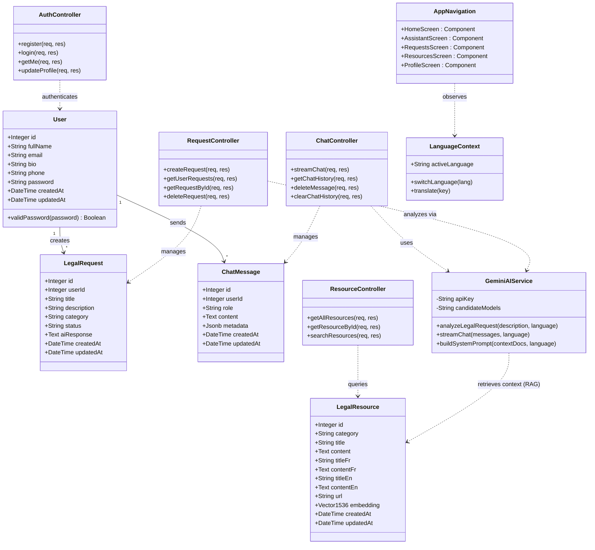

# Class Diagram - Maison du Droit

```mermaid
classDiagram
    class User {
        +Integer id
        +String fullName
        +String email
        +String bio
        +String phone
        +String password
        +DateTime createdAt
        +DateTime updatedAt
        +validPassword(password) Boolean
    }

    class LegalRequest {
        +Integer id
        +Integer userId
        +String title
        +String description
        +String category
        +String status
        +Text aiResponse
        +DateTime createdAt
        +DateTime updatedAt
    }

    class ChatMessage {
        +Integer id
        +Integer userId
        +String role
        +Text content
        +Jsonb metadata
        +DateTime createdAt
        +DateTime updatedAt
    }

    class LegalResource {
        +Integer id
        +String category
        +String title
        +Text content
        +String titleFr
        +Text contentFr
        +String titleEn
        +Text contentEn
        +String url
        +Vector1536 embedding
        +DateTime createdAt
        +DateTime updatedAt
    }

    class GeminiAIService {
        -String apiKey
        -String candidateModels
        +analyzeLegalRequest(description, language)
        +streamChat(messages, language)
        +buildSystemPrompt(contextDocs, language)
    }

    class AuthController {
        +register(req, res)
        +login(req, res)
        +getMe(req, res)
        +updateProfile(req, res)
    }

    class ChatController {
        +streamChat(req, res)
        +getChatHistory(req, res)
        +deleteMessage(req, res)
        +clearChatHistory(req, res)
    }

    class RequestController {
        +createRequest(req, res)
        +getUserRequests(req, res)
        +getRequestById(req, res)
        +deleteRequest(req, res)
    }

    class ResourceController {
        +getAllResources(req, res)
        +getResourceById(req, res)
        +searchResources(req, res)
    }

    class AppNavigation {
        +HomeScreen : Component
        +AssistantScreen : Component
        +RequestsScreen : Component
        +ResourcesScreen : Component
        +ProfileScreen : Component
    }

    class LanguageContext {
        +String activeLanguage
        +switchLanguage(lang)
        +translate(key)
    }

    User "1" --> "*" LegalRequest : creates
    User "1" --> "*" ChatMessage : sends

    RequestController ..> LegalRequest : manages
    ChatController ..> ChatMessage : manages
    ResourceController ..> LegalResource : queries
    AuthController ..> User : authenticates

    ChatController ..> GeminiAIService : uses
    RequestController ..> GeminiAIService : analyzes via
    GeminiAIService ..> LegalResource : retrieves context (RAG)

    AppNavigation ..> LanguageContext : observes
```
